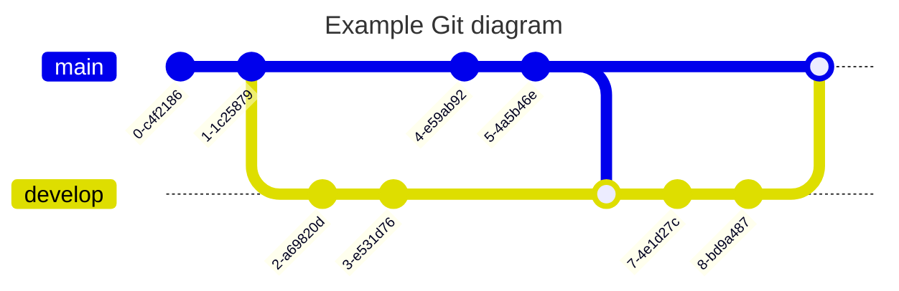

# sq-git-workshop

```mermaid
---
title: Example Git diagram
---
gitGraph
   commit
   commit
   branch develop
   checkout develop
   commit
   commit
   checkout main
   commit
   commit
   checkout develop
   merge main
   commit
   commit
   checkout main
   merge develop
```

Change 1.
Change 2.

# Main changes

Change 3.
